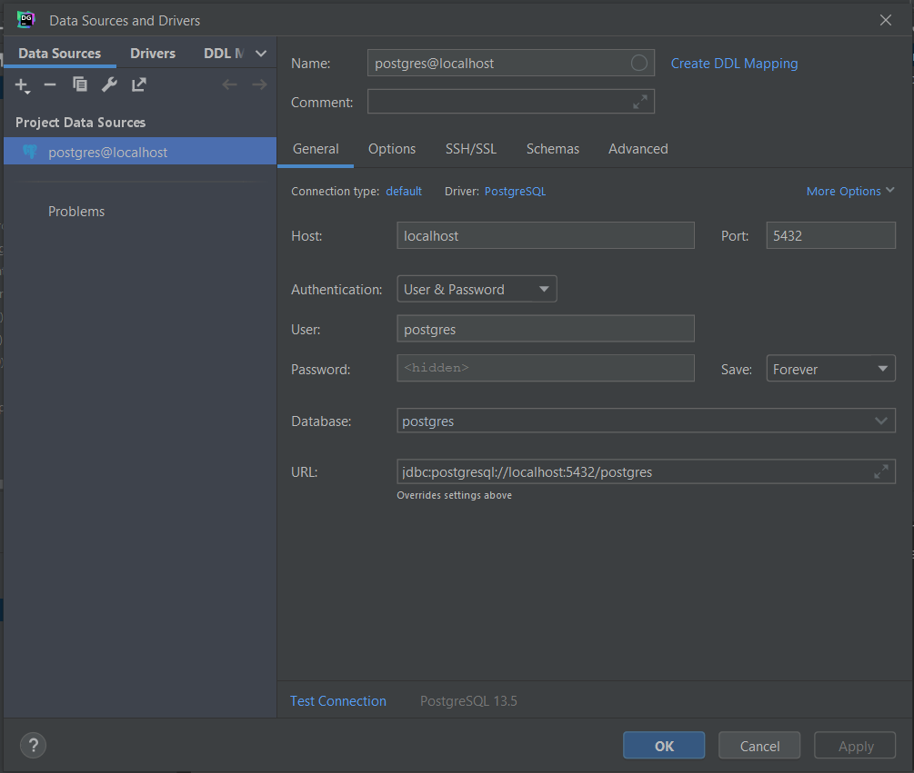

## Скрипт синхронизации данных с Google-таблицой в качестве источника

[](https://www.python.org/)
[](https://www.djangoproject.com/)
[](https://www.django-rest-framework.org/)
[](https://www.postgresql.org/)
[](https://www.docker.com/)
[](https://developers.google.com/sheets/api)

Проект представляет собой связку бэкенд-приложения и БД PostgreSQL, работающих в двух запускаемых контейнерах.

Скрипт отслеживает изменения в таблице-источнике и заносит изменения в БД PostreSQL, добавляет колонку стоймости в рублях, а так же отправляет в телеграм сообщение,
если срок поставки истёк.

Просмотр текущего состояния таблицы "Orders" БД можно осуществить:
1. Через админку Django
2. Посредством API в приложении Postman. Таблица после запуска сервера будет доступна по адресу: http://localhost:8000/api/orders

### Как начать работать со скриптом:

1. Склонируйте репозиторий на локальную машину

2. В директории 'test_task_script/service' создайте файл окружения *.env и внесите следующие данные.
```
DB_ENGINE=django.db.backends.postgresql
DB_NAME=postgres
POSTGRES_USER=postgres
POSTGRES_PASSWORD=postgres
DB_HOST=db
DB_PORT=5432
DJ_SECRET_KEY=<секретный ключ проекта>

TELEGRAM_TOKEN=<Телеграм токен вашего бота> #можно узнать у бота @BotFather
TELEGRAM_CHAT_ID=<Телеграм токен принимающего аккаунта> #можно узнать у бота @userinfobot
```

3. Запустите контейнеры командой 
```
docker-compose up -d --build
```

4. Пользуясь приложением DataGrip (https://www.jetbrains.com/ru-ru/datagrip/download/), инициализировать БД.
Для этого заходим в DataGrip Файл -> новый проект, (+) -> добавить источник -> PostgreSQL -> заполняем поля, как показано на изображении: (поле password: postgres)


Затем в консоле запросов выполнить следующие команды (выделить всё и нажать на зелёный треугольник):
```
CREATE
    OR REPLACE FUNCTION trigger_set_timestamp()
    RETURNS TRIGGER AS
$$
BEGIN
    NEW.updated_at
        = NOW();
    RETURN NEW;
END;
$$
    LANGUAGE plpgsql;

CREATE TABLE Orders
(
    id                        SERIAL                    NOT NULL PRIMARY KEY,
    table_row_index           INTEGER                   NOT NULL UNIQUE,     
    table_row_number          INTEGER                   NOT NULL,
    order_number              INTEGER                   NOT NULL UNIQUE,
    cost_usd                  NUMERIC(12, 2)            NOT NULL,
    cost_rub                  NUMERIC(12, 2)            NOT NULL,
    delivery_date             CHAR(10)                  NOT NULL,
    created_at                TIMESTAMPTZ               NOT NULL DEFAULT NOW(),
    updated_at                TIMESTAMPTZ               NOT NULL DEFAULT NOW()
);

CREATE TRIGGER set_timestamp
    BEFORE UPDATE
    ON Orders
    FOR EACH ROW
EXECUTE PROCEDURE trigger_set_timestamp();

INSERT INTO Orders(
  table_row_index,
  table_row_number,
  order_number,
  cost_rub,
  cost_usd,
  delivery_date
) VALUES (
  57, 1, 1342,
  300::NUMERIC(12, 2),   -- приведение типа
  18000::NUMERIC(12, 2), -- приведение типа
  '04.07.2022'::char(10) -- приведение типа
);

CREATE
    OR REPLACE FUNCTION upsert_orders(
        arg_table_row_index INTEGER,
        arg_table_row_number INTEGER,
        arg_order_number INTEGER,
        arg_cost_usd DOUBLE PRECISION,
        arg_cost_rub DOUBLE PRECISION,
        arg_delivery_date CHAR(10)
    )
    RETURNS VOID AS
$$
DECLARE
BEGIN
    UPDATE Orders as o SET
        table_row_number = arg_table_row_number,
        order_number = arg_order_number,
        cost_usd = arg_cost_usd,
        cost_rub = arg_cost_rub,
        delivery_date = arg_delivery_date
    WHERE table_row_index = arg_table_row_index;

    IF NOT FOUND THEN

    INSERT INTO Orders(table_row_index, table_row_number, order_number, cost_rub, cost_usd, delivery_date)
    VALUES (arg_table_row_index, arg_table_row_number, arg_order_number, arg_cost_rub, arg_cost_usd, arg_delivery_date);

    END IF;
END;
$$
    LANGUAGE plpgsql;
```

5. Выполнить миграции и создать суперюзера.
Для этого последовательно выполняем команды и действия:
```
docker ps
```
Скопировать ID контейнера 'test_task_script_backend' и использовать его в следующей команде
```
docker exec -it <CONTAINER_ID> bash
cd service
python manage.py migrate
python manage.py createsuperuser
```
Придумать, ввести и запомнить данные суперюзера.
```
Таблица и суперюзер созданы!


6. Наконец запустить скрипт.
Для этого следует переместиться в директорию со скриптом и выполнить команду запуска питон-файла
```
cd service
python main.py
```

Скрипт запустится и каждую минуту будет отслеживать изменения. Интервал отслеживания можно изменить, изменив значение переменной
'GS_POLLING_INTERVAL' в модуле 'service/service/googlesheet.py'. При первом вызове скрипта и при обнаружении изменений, скрипт перезапишет данные таблицы.

После запуска данные из таблицы будут доступны по адресу: http://localhost:8000/api/orders или в Django-админке.
